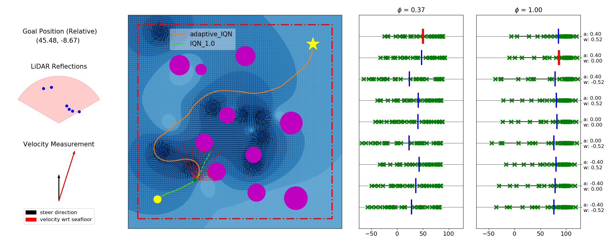

# Distributional RL for Navigation

This repository provides the codes of our IROS 2023 paper [here](https://arxiv.org/abs/2307.16240). We developed a simulation environment for studying decision making problem in sensor-based Unmanned Surface Vehicle (USV) navigation scenarios (amidst unknown currents and obstacles), and proposed a Distribution RL based path planner that shows superior performance in safety, time and energy consumption vs. traditional RL and classical reactive planning algorithm. The performance of our approach is visualized in the video [here](https://robustfieldautonomylab.github.io/Lin_IROS_2023_video.mp4).

<p align="center">
 
</p>

Please cite as:
```
@INPROCEEDINGS{10342389,
  author={Lin, Xi and McConnell, John and Englot, Brendan},
  booktitle={2023 IEEE/RSJ International Conference on Intelligent Robots and Systems (IROS)}, 
  title={Robust Unmanned Surface Vehicle Navigation with Distributional Reinforcement Learning}, 
  year={2023},
  volume={},
  number={},
  pages={6185-6191},
  doi={10.1109/IROS55552.2023.10342389}}
```

## Train RL Agents

We provide pretrained IQN and DQN models and their learning evaluation files in the pretrained_models directory, and you can skip this section if you don't want to train RL agents on your own.

The implementation of DQN agent is based on [stable-baselines3](https://github.com/DLR-RM/stable-baselines3), which serves as the traditional RL baseline method in our paper. To train a DQN agent, run the following command. 

```
python train_sb3_model.py -C config/config_DQN.json [-P NUM_PROCS] [-D DEVICE]
```

Our proposed method is based on IQN, and we use the implemntation of [IQN-and-Extensions](https://github.com/BY571/IQN). To train an IQN agent, run the following command.

```
python train_IQN_model.py -C config/config_IQN.json [-P NUM_PROCS] [-D DEVICE]
```

-P and -D flags are optional. -P can be used to specify the number of processes to be run in parallel when training multiple models. -D can be used to specify the CPU or GPU intended to be used in training.

## Evaluate Learning Performance

We provide scripts for plotting learning performance and visualizing evaluation episodes of trained RL agents.

To plot learning curves, if you want to evaluate your own trained models, please specify data_dir and seeds in plot_eval_returns.py to the directories storing corresponding trained RL models.

```
python plot_eval_returns.py
```

To visualize an evaluation episode, if you want to use your own IQN evaluation files, please set config_file and eval_file in visualize_IQN_eval_episode.py to corresponding eval_config.txt and greedy_evaluations.npz (or adaptive_evluations.npz). 

```
python visualize_IQN_eval_episode.py
```

## Run Experiments

We provide the implementation of agents using Artificial Potential Field (APF) and the Bug Algorithm (BA). If you want to use your own trained models, before running the evaluation experiments, please set save_dir in run_experiments.py to the directories storing corresponding trained RL models.

```
python run_experiments.py
```
